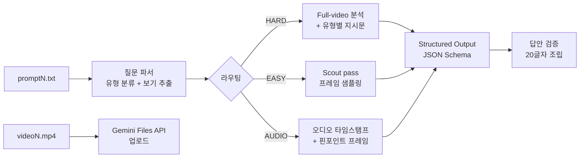
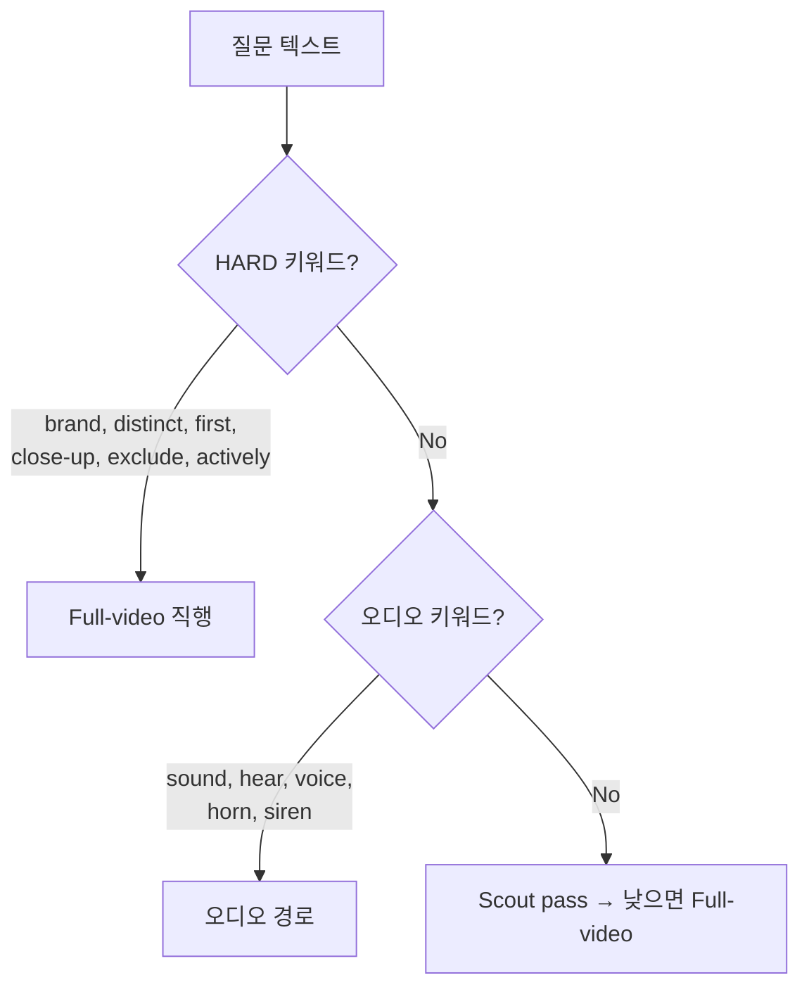
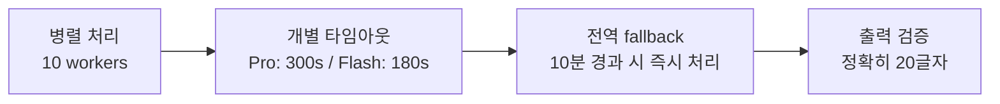
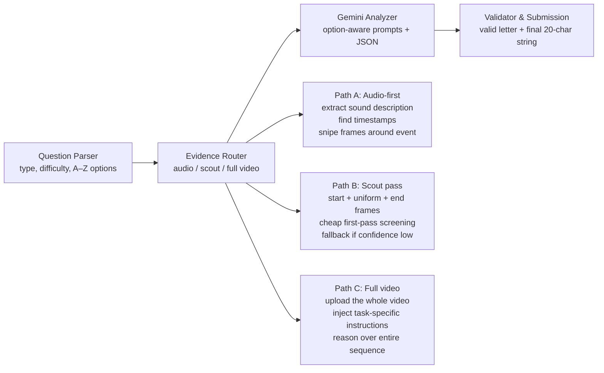

<div align="center">

# VideoAgent
### Question-Aware Cascaded Video Analysis System

<p>
  
  
  
  
  
</p>

**Started with a single Gemini API call per video.**  
**Finished with a question-aware routing pipeline, structured output, and parallel execution under 4 minutes.**

KRAFTON AI R&D Hackathon · Round 2 · Problem 3 · 5 Hours · Spring 2026

</div>

---

## 프로젝트 한눈에 보기

이 프로젝트는 **20개의 비디오에 대한 객관식 질문에 15분 안에 자동 답변하는 시스템**을 만드는 해커톤 과제를 기반으로 합니다.

핵심 제약은 세 가지였습니다.

- **20개 비디오** — 각각 최대 1200초, 파일 크기 6MB~641MB
- **26개 보기** — A부터 Z까지 가변적인 선택지
- **15분 제한** — 업로드, 분석, 답변 생성까지 전부 포함

예선부터 1일차까지는 그저 AI 서비스 접근방식 다양화에 불과했습니다. 평소처럼 미리 `plan.md`를 만들어 전략을 정리하고, 문제를 받자마자 GPT Pro에 '딸깍'하려 했습니다.

```text
# plan.md (실제 작성했던 전략)
1. gpt pro 확장 바로 돌리기
2. gpt pro AI 출제 공략 분석 후 진행
3. gpt pro → claude code에 프롬프트 작성 요구 후 gpt pro 진행
4. claude code → 우로보로스 인터뷰로 진행
```

그런데 문제를 다시 정독하는 순간 멈췄습니다. **이건 그런 식으로 접근해선 안 되는 문제였습니다.** 비디오가 주어지기 전에 파이프라인을 튜닝해둬야 했고, 단순히 강한 모델에 던지는 것으로는 부족했습니다.

결국 plan을 드랍하고, 접근법부터 모델 선정까지 전부 **어린아이가 묻듯이** Claude Opus에 물어가면서 처음부터 설계했습니다. 중간에 Codex + Ouroboros 조합으로 접근방식 다양화를 시도하려 했으나, Claude Code 설치 과정에서 설정이 꼬여 에러가 계속 나는 바람에 단일 파이프라인에 집중하게 되었습니다.

> 돌이켜보면, 평소 전략을 버리고 문제 자체에 집중한 것이 오히려 맞는 판단이었습니다.

---

## 핵심 결과

| 지표 | 값 |
|---|---:|
| **처리 완료** | **20/20** (fallback 0건) |
| **Pro 1회 소요** | **228초** (3분 48초) |
| **Pro 3회 투표 소요** | **635초** (10분 35초) |
| **타임아웃** | **0건** (Pro 1회 기준) |
| **병렬 처리** | **10 workers** |

### 실전 실행 결과

```text
Pro 1회:        CGSCIVIPEFJBJJBDADKF  (228초)
Pro 3회 투표:   DASCHOAPEFJBJGBDADAF  (635초)
최종 제출:      DGSCIEIPEFJBJGBDADKF  (Pro + Vote 종합)
```

---

## What I Actually Built

### 전체 파이프라인



### 1) 질문 분류 & 라우팅 — 질문이 경로를 결정한다



핵심 설계 결정: **HARD 체크가 오디오 체크보다 반드시 먼저 실행**됩니다.

`"actively being played"`처럼 음악 관련 표현이 오디오 키워드에 걸려 잘못된 경로로 빠지는 버그를 실제로 겪었고, 라우팅 우선순위를 바꾸는 것만으로 해당 문항의 정답률이 0%에서 100%로 바뀌었습니다.

### 2) Option-Aware Prompting — 생성이 아니라 검증

이 시스템은 답을 **생성**하지 않습니다. 주어진 보기를 **검증**합니다.

```python
# 보기 동적 추출 (A~Z 가변)
options = extract_options(prompt_text)  # ["A) DeWALT", "B) Makita", ...]

# 프롬프트에 보기 전체를 넣고 "각 보기를 비디오 증거와 대조하라"고 지시
prompt = f"""
{question}
OPTIONS: {options}
Evaluate EACH option against video evidence.
"""
```

자유 서술 대신 closed-set 검증을 쓴 이유:

- 26개 보기 중에는 매우 유사한 선택지가 있음 (예: `T667332C` vs `T667322C` vs `T667333C`)
- "답을 맞혀라"보다 "각 보기가 맞는지 하나씩 확인하라"가 더 정확함

### 3) Structured Output — JSON Schema로 답을 강제

```python
config = types.GenerateContentConfig(
    response_mime_type="application/json",
    response_schema={
        "type": "object",
        "properties": {
            "answer": {"type": "string", "enum": valid_letters},
            "confidence": {"type": "number"},
            "reasoning": {"type": "string"}
        },
        "required": ["answer", "confidence", "reasoning"]
    }
)
```

이전에는 `ANSWER: A\nCONFIDENCE: 0.95` 형식을 정규표현식으로 파싱했는데, 간헐적으로 형식이 깨져서 confidence가 0.0으로 잡히는 문제가 있었습니다. JSON Schema 강제로 **파싱 실패율을 0%**로 만들었습니다.

### 4) 유형별 추가 지시문 — 질문 유형에 맞는 분석 전략

| 유형 | 트리거 | 추가 지시 |
|---|---|---|
| **brand_ocr** | brand, logo, text | 도구의 색상/로고 위치를 기술하라. 맥락 추론 금지. |
| **counting_scene** | distinct, angle, scene | 각 위치를 나열 후 중복 병합. 확신 없으면 병합. |
| **ordered_event** | first, fifth, last | [1], [2], [3]... 타임스탬프와 함께 나열 후 재확인. |
| **audio_trigger** | sound, hear, voice | 정확한 타임스탬프 식별 → 해당 시점 시각 분석. |

### 5) 시간 관리 — 15분 안에 끝내는 3계층 제어



| 실행 모드 | 모델 | 타임아웃 | 동작 |
|---|---|---|---|
| `(기본)` | Gemini 3 Flash | 180s | Flash 1회 |
| `--pro` | Gemini 3.1 Pro | 300s | Pro 1회 |
| `--vote` | Flash × 3 | 180s | 3회 다수결 |
| `--pro --vote` | Pro × 3 | 300s | Pro 3회 다수결 |

---

## 흥미로운 발견

### Confidence 1.0이어도 틀릴 수 있다

시부야 교차로 타임랩스에서 "카메라 앵글 수"를 물었을 때, Gemini는 매번 confidence 0.95~1.00을 반환했지만 답은 **8, 1, 6, 4, 3**으로 매번 달랐습니다. 정답은 5였고, 한 번도 맞추지 못했습니다.

이 발견 때문에 confidence 기반 재시도 전략을 폐기하고, **질문 패턴 기반 라우팅**으로 전환했습니다.

### 라우팅 우선순위 한 줄이 정확도를 바꿨다

볼레로 연주 영상에서 "5번째로 클로즈업된 악기"를 물었을 때, `"actively playing"`이라는 표현이 오디오 키워드에 걸려서 **프레임 몇 장만 보고 오답**을 냈습니다.

HARD 체크를 오디오 체크보다 먼저 실행하도록 한 줄을 바꾸자, 같은 문항이 **full-video 경로를 타고 정답**을 맞추기 시작했습니다.

### Pro vs Flash — 정확도와 시간의 트레이드오프

볼레로 문항에서 Flash는 7번 시도 중 1번만 정답(Bassoon)을 맞췄지만, Pro는 더 높은 확률로 정답에 도달했습니다. 다만 Pro는 처리 시간이 약 40% 더 걸려서, 23분짜리 영상을 Flash→Pro 이중 패스로 처리하면 타임아웃이 발생했습니다.

최종 전략: **Pro 직행 1회**가 가장 안정적.

### KRAFTON VLM-SubtleBench와의 일치

KRAFTON의 VLM-SubtleBench (ICLR 2026)가 지적한 VLM 약점 — temporal reasoning, viewpoint reasoning, counting — 이 실제로 가장 어려운 문항 유형이었습니다. 장면 수 세기와 순서 추적은 현세대 VLM의 공통적인 한계입니다.

---

## 왜 이 프로젝트가 포트폴리오로 의미가 있나

이 저장소는 단순한 "API 호출 래퍼" 기록이 아닙니다.

### 보여주고 싶은 역량

- **문제 분해 능력**  
  "비디오 QA"를 질문 분류 → 증거 수집 → 검증 → 시간 관리로 분해해 파이프라인에 반영

- **운영 설계 감각**  
  모델 성능만 올리려 하지 않고, 라우팅/타임아웃/fallback/병렬화 등 **시스템 운영 차원**에서 점수를 확보

- **실패에서 배우는 디버깅**  
  confidence 과신 문제, 라우팅 우선순위 버그, video-prompt 매칭 오류를 실전에서 발견하고 수정

- **AI-assisted workflow를 결과물로 바꾸는 능력**  
  Claude Code + Gemini API를 조합해 5시간 안에 완전한 파이프라인을 구축

---

## 프로젝트 구조

```
video_agent/
├── main.py              # 메인 실행, 병렬 처리, 라우팅, 시간 관리
├── video_qa.py          # Gemini API 호출, structured output, 파싱
├── audio_analyzer.py    # 질문 분류, 오디오 키워드 탐지
├── frame_extractor.py   # OpenCV 프레임 추출 (scout/pinpoint/end)
├── prompts.py           # 프롬프트 템플릿 + 유형별 추가 지시문
├── test_connection.py   # API 연결 테스트
├── .env                 # GEMINI_API_KEY
└── video/               # 실전 비디오/프롬프트 폴더
```

---

## 산출물

- [Report PDF](./VideoAgent_Report.pdf)
- [Source Code](./video_agent/)

리포트에는 다음이 포함되어 있습니다.

- 시스템 설계 및 파이프라인 구조
- Option-Aware Prompting & Structured Output
- 시간 관리 전략
- 흥미로운 발견 6가지
- 한계 및 개선 방향
- 기술 스택

---

## 실행 방법

```bash
# .env 파일에 API 키 설정
echo "GEMINI_API_KEY=your_key_here" > .env

# Pro 모델로 실행 (추천)
python main.py "video/" --total 20 --pro

# Flash 모델로 빠르게 실행
python main.py "video/" --total 20

# 3회 다수결 투표
python main.py "video/" --total 20 --vote

# Pro + 투표 (가장 정확, 시간 소요 큼)
python main.py "video/" --total 20 --pro --vote
```

권장 환경:

- Python 3.10+
- `google-genai`, `opencv-python`, `Pillow`, `python-dotenv`
- Gemini API 키 (Google AI Studio)

---

## 한계 & 개선 방향

- **장면 수 세기**: PySceneDetect + perceptual hash 클러스터링으로 보강 가능
- **순서 추적**: shot-level 분류 + 고FPS 프레임 추출로 정밀도 향상 가능
- **객체 카운팅**: YOLO + ByteTrack 통합으로 정확한 개수 산출 가능
- **비결정적 출력**: temperature 제어 또는 앙상블 전략으로 일관성 확보 가능

설치만 해두고 통합하지 않은 도구: `ultralytics`, `scenedetect`, `paddleocr`  
→ 반복적으로 같은 유형이 틀릴 때만 제한적으로 붙이는 전략이 맞다고 판단했습니다.

---

## 정직한 메모

원래 해커톤 제출은 제한 시간 때문에 패키징이 아쉬웠습니다.

- 라우팅 우선순위 버그를 실전 직전에 발견
- video-prompt 매칭 오류로 초반 테스트 전량 오답
- confidence 기반 전략을 3번 갈아엎음

이 저장소는 그 결과물을 **요구사항에 맞게 다시 정리한 포트폴리오 버전**입니다.

그래서 이 리포지토리는 "완벽한 실전 제출본"보다는,

> **짧은 시간 안에 문제를 실제로 풀어냈고, 그 과정에서 발견한 VLM의 한계와 운영 설계의 중요성을 기록한 작업물**

에 가깝습니다.

---

## 한 줄 요약

**단일 API 호출에서 출발했지만, 결국은 질문 인식 라우팅 + structured output + 병렬 처리 + 3계층 시간 관리까지 갖춘 비디오 QA 파이프라인을 만든 프로젝트.**

---
---

<div align="center">

# 📄 VideoAgent Report
### Automated Question-Aware Budget-Constrained Video QA

KRAFTON AI R&D Hackathon · Round 2 · Problem 3 · Spring 2026

</div>

<table>
<tr><td><b>20</b> video–prompt pairs per test run</td><td><b>≤ 1200s</b> maximum duration per video</td></tr>
<tr><td><b>≤ 15 min</b> hard wall-clock submission budget</td><td><b>20 letters</b> exact output format guaranteed</td></tr>
</table>

**Core idea.** VideoAgent does not treat this challenge as generic video summarization. It treats it as prompt-conditioned evidence retrieval under a strict wall-clock budget. The system first interprets the question, then allocates computation only where the question demands it: audio-localized frame sniping for sound-triggered queries, scout-pass frame sampling for simple visual questions, and full-video analysis for hard visual or temporal reasoning.

---

### Executive Summary

We built an end-to-end agent that automatically answers objective multiple-choice questions about videos with no intervention at test time. The design goal was to maximize accuracy while still being robust to long videos, API latency, and output-format failures.

| What is novel in this system | Why this design fits the challenge |
|---|---|
| Question-first routing before expensive video processing | Not all questions need the same evidence granularity |
| Option-aware verification instead of free-form answer generation | Long videos punish naive full-video prompting on every sample |
| Structured JSON output to constrain answers to valid option letters | Objective multiple-choice QA benefits from explicit option verification |
| Wall-clock safety mechanisms to guarantee a complete 20-letter submission | Hackathon conditions reward robust orchestration as much as model quality |

---

### 1. System Overview

The pipeline starts from the question, not the pixels. We first parse the prompt, extract all answer choices dynamically, classify the reasoning type, and choose the cheapest evidence acquisition strategy that is still likely to answer the question correctly. This is the main departure from a single end-to-end "watch the whole video and answer" baseline.



---

### 2. Question-Aware Routing

Routing policy is the most important systems decision in this project. A single fixed analysis mode is either too slow or too brittle. Our router combines question type, difficulty heuristics, video duration, and upload-size limits to select a path.

| Route | Typical triggers | Evidence strategy | Why it helps |
|---|---|---|---|
| **Audio-first** | sound, hear, horn, voice, music | Extract the target sound description, search timestamps in a WAV file or directly in the video audio track, then analyze frames around the detected moment. Retry with denser frame sampling if confidence is low. | Most audio questions are really "what is visible at the moment of this sound?" Timestamp localization narrows the search space dramatically. |
| **Hard visual / temporal** | brand, logo, text, scene count, first / fifth / last | Skip scout pass and send the full video with specialized instructions for OCR/brand identification, ordered-event tracking, or scene counting. | These questions depend on global chronology or fine-grained evidence that sparse frame sampling often misses. |
| **Easy visual** | Simple presence, color, brightness, or coarse motion questions on short videos | Scout pass uses one start frame, uniform frames across the clip, and end frames. Accept if confidence ≥ 0.85; otherwise escalate to full-video analysis. | Saves time and tokens on easy cases while preserving an escalation path for uncertain predictions. |
| **Large-file fallback** | Video size > 200 MB | Avoid upload bottlenecks and use uniform frame extraction instead. | Prevents large uploads from dominating the wall-clock budget. |

**Implementation detail.** The current code uses three coarse question classes: A (audio), B (visual), and C (temporal/order-sensitive). Additional hard-keyword rules decide whether scout pass can be skipped safely.

---

### 3. Evidence Acquisition and Task-Specific Prompting

**Scout pass** is intentionally cheap. For very short clips, it samples 9 frames (start + 6 uniform + 2 end). For longer short clips, it samples 19 frames (start + 15 uniform + 3 end), deduplicates nearby timestamps, and asks the model to answer using only these frames. This pass is effective when the answer is persistent or visually obvious, but it is not trusted on sparse-event or order-sensitive questions.

**Audio-localized frame sniping:** For audio questions, the system first searches for the exact sound event and then extracts consecutive frames around the detected timestamp. This converts a broad multimodal reasoning problem into a much narrower visual QA problem centered on the relevant moment. If the first answer has confidence below 0.70, the system retries using denser 0.2-second frame spacing.

**Full-video prompt specialization** — prompts are not generic. The router injects task-specific instructions that match the failure mode of the question:

| Template | Instruction |
|---|---|
| **brand_ocr** | Quote exact text/logo and describe location on the object. |
| **counting_scene** | Merge minor zoom/pan changes and list unique viewpoints before counting. |
| **ordered_event** | Enumerate every qualifying event chronologically, then select the Nth one. |
| **audio_trigger** | Anchor the answer to the precise sound timestamp. |

> **Why prompting matters here:** In this hackathon setting, carefully engineered prompts delivered more value than hurriedly stacking additional specialist modules. The prompts explicitly force the model to list evidence before answering, which reduces superficial guesses and makes reasoning more aligned with the objective nature of the benchmark.

---

### 4. Option-Aware Answering and Output Reliability

The challenge requires a single answer letter for each sample, not a free-form explanation. We therefore model the task as verification over a finite option set instead of unconstrained generation.

**Dynamic option parsing:** The system extracts answer choices dynamically from each prompt, supporting variable option counts from A through Z. This matters because the benchmark does not guarantee a fixed 4-way format. Every model response is validated against the parsed option set. Invalid outputs are replaced with a safe fallback letter so the final answer string is always well-formed.

**Structured JSON output:** Gemini is asked to return a strict JSON object with `answer`, `confidence`, and `reasoning`. The answer field is constrained to the valid option letters for that question.

```json
{
  "answer": "C",
  "confidence": 0.82,
  "reasoning": "The relevant event appears after the horn at around 12.5s..."
}
```

> **Important empirical finding.** In our testing, raw VLM confidence was often poorly calibrated: answers could be incorrect even when the model reported very high confidence. For that reason, confidence is used mainly for routing decisions (e.g., scout accept / retry) rather than as a direct proxy for correctness.

---

### 5. Time-Budget Engineering

The benchmark is as much a systems problem as a reasoning problem. A strong answering strategy that misses the deadline is still a failed submission. VideoAgent therefore implements multiple layers of time control.

| Layer | Mechanism | Current setting |
|---|---|---|
| **Parallelism** | All samples are processed concurrently using a thread pool. | `ThreadPoolExecutor(max_workers=10)` |
| **Per-video timeout** | Each sample has its own timeout. If a thread finishes late but already produced a partial result, that result can still be used. | 180s (Flash) / 240s (Pro) |
| **Internal wall-clock budget** | The system targets a 14-minute internal budget to leave extra time for final packaging and submission. | `MAX_TOTAL_TIME = 14 min` |
| **Global fallback trigger** | If the run is already late, remaining items are forced through a cheaper fallback path. | `FALLBACK_TIME = 12 min` |
| **Output guarantee** | The validator always emits exactly N letters in index order, filling missing entries with a default safe answer if necessary. | `validate_final_output()` |

| Mode | Model | Passes | Use case |
|---|---|---|---|
| `(default)` | Gemini 3 Flash preview | 1 | Fastest mode for deadline-sensitive evaluation. |
| `--pro` | Gemini 3.1 Pro preview | 1 | Higher accuracy on difficult reasoning, but higher timeout risk. |
| `--vote` | Flash | 3 | Majority vote across repeated runs when extra time is available. |
| `--pro --vote` | Pro | 3 | Most expensive mode; mainly useful for offline testing. |

> Internal budget ends before the external deadline to preserve submission safety.

---

### 6. What We Learned During Development

**Confidence is not enough.** Repeated runs on difficult questions often produced different answers with similarly high confidence values. This pushed us away from confidence-based retries and toward question-pattern-based routing.

**Scene counting remains difficult.** Counting distinct camera angles or viewpoints is one of the hardest categories for current VLMs. Models tend to over-split minor framing changes into new scenes.

**Ordered events need global chronology.** Questions such as "what is the fifth close-up instrument?" require exhaustive chronological enumeration. Full-video analysis plus ordered-event prompting was substantially safer than sparse sampling.

**Scout pass is high leverage but brittle.** Uniform frame sampling works very well for persistent properties like color or presence, but it can miss sparse events entirely in long videos. Restricting scout pass to low-complexity questions was essential.

---

### 7. Limitations and Extensions

| Current limitation | Likely next improvement |
|---|---|
| Distinct scene / angle counting is unstable. | Add shot-boundary detection plus perceptual-hash or embedding-based viewpoint clustering. |
| Object counts can still drift on crowded scenes. | Integrate detector + tracker pipelines such as YOLO + ByteTrack / BoT-SORT for explicit counting. |
| Ordered-event questions remain expensive. | Use shot segmentation and higher-FPS localized classification only on candidate windows. |
| Majority vote improves stability but is costly. | Explore cheaper self-consistency schemes, temperature control, or route-specific ensembles. |

---

### 8. Implementation Notes

| Functional area | Role in the pipeline |
|---|---|
| **Question interpretation** | Extract the question type, difficulty cues, and full answer-choice set before expensive analysis begins. |
| **Evidence routing** | Choose among audio-first lookup, scout-pass sampling, or full-video reasoning depending on the evidence required. |
| **Audio localization** | Narrow sound-triggered questions to a small time window so the visual search space becomes manageable. |
| **Frame sampling** | Use sparse sampling for easy visual questions and denser localized extraction when sparse evidence is insufficient. |
| **Option-aware verification** | Constrain outputs to valid option letters and treat the task as verification over explicit choices, not free-form generation. |
| **Submission safety** | Use timeouts, fallback paths, and final validation so every item still contributes a valid answer letter before the deadline. |

| Component | Technology |
|---|---|
| Primary VLM | Gemini 3 Flash / 3.1 Pro |
| API client | google-genai |
| Frame extraction | OpenCV + Pillow |
| Parallelism | ThreadPoolExecutor |
| Output | Structured JSON Schema |
| Environment | Python 3.13 |

---

### Closing Remark

VideoAgent is a pragmatic hackathon system: small enough to build quickly, but structured enough to handle the core difficulty of the benchmark. The report's central claim is simple: **accurate video QA under a hard deadline requires question-aware allocation of reasoning budget.** Our implementation operationalizes that claim through routing, constrained prompting, and system-level safeguards that convert a general-purpose VLM into a more reliable competition-time agent.
